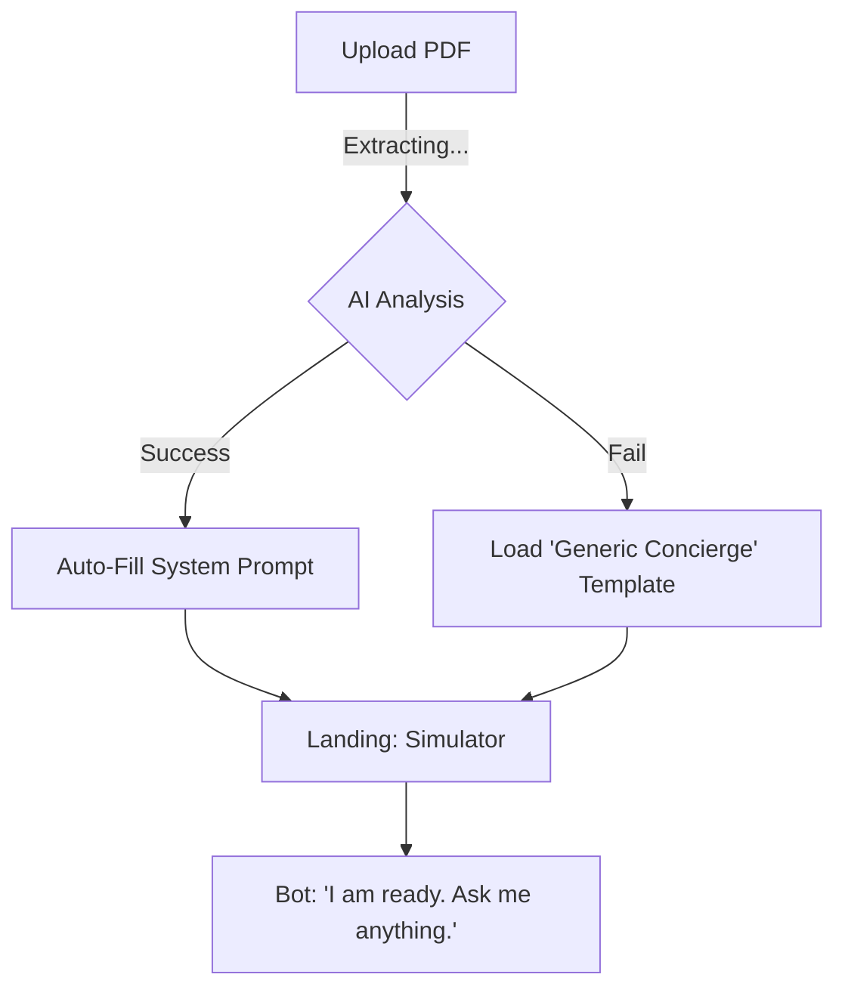
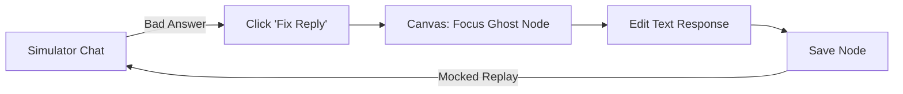

# UX Design Specification (Mantis)

**Author:** Team Mantis
**Date:** 2026-01-31

---

## Executive Summary

### Project Vision

Mantis is the "15-Minute Agency" platform. It allows Distributors to mass-produce compliant, simple AI chatbots for SMEs using strictly scoped templates. The UX prioritizes *speed of deployment* over *flexibility of creation*.

### Target Users

- **Primary (Builder):** Paolo, a micro-agency owner. Values speed, clonability, and reliability.
- **Secondary (Consumer):** Maria, a local business owner. Values zero-maintenance lead generation.

### Key Design Challenges

1. **Enforcing Constraints:** Making the 30-node limit and standard templates feel like "Best Practices" rather than "Limitations".
2. **Invisible Compliance:** Managing the complexity of Meta's 24h Policy so users don't accidentally get banned.
3. **Trust Visualization:** Showing the "AI Temperature" (Low Hallucination) and "Safety Guards" clearly to anxious business owners.

### Design Opportunities

- **The "Deployment Wizard":** A hyper-optimized onboarding flow that goes from 'Login' to 'Live Bot' in 4 clicks.
- **"Complexity Meter":** A visual indicator in the customized ReactFlow builder that warns users before they hit the 30-node ceiling.
- **"Report-First" Design:** Treating the daily email report as a core UI surface, designed with the same care as the dashboard.

## Core User Experience

### Defining Experience

The Mantis experience is defined by **Industrialized Simplicity**. Unlike generic builders that are "Canvases", Mantis is a "Assembly Line". The user does not *create*; they *configure*.

### Platform Strategy

- **Web-First Dashboard:** Optimized for desktop/mouse interaction (ReactFlow canvas).
- **Mobile-Responsive View:** Read-only access for status checks and report viewing.

### Effortless Interactions

- **Knowledge Injection:** Drag-and-drop PDF upload -> Instant AI Context updates.
  - *Graceful Failure:* If parsing fails, redirect to the standard text editor with raw text pre-filled (No new UI required).
- **Template Cloning:** One-click duplication to spin up new tenants.
  - *Behavior:* Copies Flow Structure and System Prompt. Does NOT copy Chat Logs.
  - *Credentials:* Uses **"Agency Keychain"** pattern to inherit the Agency's OpenAI Key by default, keeping it 1-click.
- **Visual Validation:** Real-time feedback in the builder.

### Critical Success Moments

- **The "Aha!" Preview:** The first time the AI correctly answers a question based on uploaded specific data.
- **Deployment Confirmation:** Clear, celebratory feedback when the bot is connected to a live page.
- **First Lead:** The arrival of the first "Daily Report" showing actual captured data.

### 1.1 Skills & Templates UI

- **Skill Tiles:** Skills (Scheduler, FAQ) are visualized as "Chips" or "Badges" on the Template card.
- **Skill Configuration:** Clicking a skill badge opens a simplified settings sheet (e.g., "Set Business Hours").

### 1.2 "Context Stuffing" Visualization

- **Token Meter:** A visual bar (green/yellow/red) showing "Brain Capacity" usage when uploading PDFs.
- **Why:** Abstract the technical "50k Token Limit" into a "Capacity" metric.

### Experience Principles

1. **Don't Make Me Think:** Preset defaults for everything (System Prompt, Temperature, Fallbacks).
2. **Efficiency Score (Not Limits):** Frame the 30-node limit as a positive "Optimization Score" (Green) rather than a restrictive warning (Red).
3. **Trust through Transparency:** Make the AI's logic (Why did it say that?) visible in the Simulator.
4. **The 2-Minute Rule:** Any management task (checking stats, updating a price) must be achievable in under 2 minutes.

## Desired Emotional Response

### Primary Emotional Goal

**"Competence without Complexity."**
The user should feel like a Technical Director, even if they can't write a line of code. The tool effectively "lends" them the IQ of an engineer.

### Emotional Journey Mapping

- **Discovery:** "This looks cleaner than ManyChat." (First Impression)
- **First Build:** "Wait, is that it? I'm done?" (Surprise at speed)
- **Error State:** "I know exactly how to fix this." (Empowerment vs. Frustration)
- **Client Handover:** "I built this system for you." (Pride/Ownership)

### Micro-Emotions

- **Safety:** The UI never lets you "break" the bot irreparably. (Undo/History is prominent).
- **Speed:** Interactions feel snappy (under 100ms) to reinforce the "15-minute" promise.
- **Clarity:** **"Speak Business, Not Code."** Use terms like "Lead" and "Conversation", ban terms like "JSON" and "Webhook".

### Design Implications

- **"The No-Fault UI":** If an error occurs, the UI takes blame ("I couldn't parse that") rather than blaming the user ("Invalid Input").
- **Celebratory Moments:** **Premium, Satisfying Feedback.** Think "Swiss Watch click" or subtle glow, NOT "Kindergarten Confetti".
- **The "God Mode" View:** A dashboard that shows all client bots humming along (green lights), triggering the "Business Tycoon" feeling.
- **The "Cha-Ching" Moment:** The "First Lead" event is not just a row in a table; it's a major notification celebrating value delivery.

### Emotional Design Principles

1. **Make the User the Hero:** The AI is the sidekick. The user is the one "building" the value.
2. **Hide the Machinery:** Like an iPhone, the complex internals are completely hidden behind a polished glass surface.
3. **Positive Reinforcement:** High-fives for small wins (connecting a page, saving a flow).

## UX Pattern Analysis & Inspiration

### Inspiring Products Impact

- **Shopify:** We steal their "Home" dashboard. The goal is to show *business health* (Leads generated), not just *bot status*.
- **Typeform:** We adopt their "Focus Mode". When editing a message, the rest of the canvas fades out.
- **TurboTax:** We use their "Check for Errors" narrative. **"Launch Readiness Checklist"** replaces a simple "Publish" button.

### Transferable UX Patterns

- **Outcome-Based Templates:** Templates are labeled by result ("Get Real Estate Reviews") not function ("Review Flow").
- **Magic Cleanup Button:** Instead of forcing auto-layout (which fights the user), provide a prominent button to "Organize Nodes" instantly.
- **The "Debounced" Simulator:** A live preview that updates ~1s after typing stops, with a clear "Syncing..." state to manage performance expectations.

### Anti-Patterns to Avoid

- **"The Blank Canvas":** Never show a user an empty grid. Always load a "Hello World" flow.
- **"Technical Toggles":** No "Advanced Mode". If a feature is too complex for the default view, it doesn't belong in MVP.
- **"Dead End Errors":** Error messages that don't offer a button to fix the problem.

### Design Inspiration Strategy

**"Shopify for Chatbots."**
We are building a business tool, not a developer tool. The aesthetic should be clean, white, and data-rich (Revenue graphs), using the "Simulator" as the creative playground.

## Design System Foundation

### 1.1 Design System Choice

**Stack:** [shadcn/ui](https://ui.shadcn.com/)
**Styling:** Tailwind CSS
**Icons:** Lucide React
**Font:** Inter (Google Fonts)
**Visual Logic:** ReactFlow (styled with shadcn tokens)

### Rationale for Selection

1. **"Own the Code":** shadcn allows us to copy components into our repo, enabling the deep customization needed for a "Premium" feel.
2. **Unified Canvas:** ReactFlow nodes will be rendered using shadcn `Card` components, ensuring the "Builder" looks like part of the "Dashboard" (no split-brain UI).
3. **Action-First Tables:** While MUI offers faster table setup, we chose shadcn (TanStack Table) to build "Lead Lists" that act like "Control Centers", not spreadsheets.

### Implementation Approach

- **Global Theme:** We will define a strict `radius`, `font`, and `color` tokens in `globals.css` to match the "Shopify" white/clean aesthetic.
- **Component Strategy:** Install minimum set (Button, Card, Dialog, Table, Form, Sheet).
- **Layout:** Use `Sidebar` component for the "God Mode" navigation.

### Customization Strategy

- **The "Accent" Color:** A professional "Tech Blue" or "Mint Green" (Money).
- **Dark Mode:** Supported immediately (for the "Developer Feel").

## 2. Core User Experience (Mechanics)

### 2.1 Defining Experience

**"Simulator-Driven Co-Pilot."**
The user builds by *simulating*. The screen is a 50/50 split between the Node Canvas (logic structure) and the Chat Simulator (user experience).

### 2.2 User Mental Model

**"Training an Employee."**
The user isn't programming a computer; they are correcting a new hire. "No, don't say that, say this."

### 2.3 Success Criteria

- **Latency:** Simulator updates in < 200ms.
- **Traceability:** 100% of simulator messages must link back to a specific Node or Knowledge Source.
- **Correction:** The "Fix" button is always visible on the last bot message.

### 2.4 Novel UX Patterns

- **Ghost Nodes:** High-confidence AI suggestions appear on the canvas as "Dotted Line/Draft" nodes. User clicks to confirm/solidify them into the graph.
- **Source Inspector:** Clicking a message in the chat determines the source.
  - If from a Node: Canvas auto-pans to focus the node.
  - If from Knowledge: PDF Viewer opens to the specific cited paragraph.

### 2.5 Experience Mechanics

1. **Trigger:** User tests a scenario in the right-hand Sidebar.
2. **Identify:** Bot fails or gives generic answer.
3. **Correct:** User clicks the message -> Source Inspector activates -> Focuses Node OR PDF.
4. **Edit:** User edits the text or "Rejects" the PDF chunk.
5. **Verify:** Simulator re-runs the last turn instantly with the new data.

## Visual Design Foundation

### Color System (Tailwind)

- **Primary Brand:** `Indigo-600` (Trustworthy, Professional, "Stripe-like").
- **Background:** `Slate-50` (Off-white foundation) with pure `White` cards.
- **Semantic Mapping:**
  - **Revenue/Leads:** `Teal-500` (Distinct "Money" color for high-value data).
  - Success: `Emerald-500` (Generic action confirmation).
  - Warning: `Amber-500` (Optimization Tips).
  - Error: `Rose-500` (Critical Failures).
  - Text: `Slate-900` (Primary), `Slate-500` (Muted).

### Typography System

- **Primary Font:** `Inter` (Google Fonts).
  - High legibility, standard for modern SaaS.
- **Data/Code Font:** `Geist Mono` (Vercel).
  - Used for System Prompts, IDs, and Analytics numbers. cleaner than standard monospace.
- **Scale:**
  - `h1`: 30px (Bold) - Page Titles.
  - `h2`: 24px (SemiBold) - Section Headers.
  - `body`: 14px (Regular) - Standard UI Text.
  - `caption`: 12px (Muted) - Helper text.

### Spacing & Layout Foundation

- **Grid:** 12-column grid for Dashboard widgets.
- **Base Unit:** 4px (Tailwind standard).
- **Component Height:** `h-9` (36px) for compact buttons; `h-10` (40px) for primary inputs.
- **Radius:** `0.5rem` (8px). Medium-soft corners.

### Accessibility Considerations

- **Dark Mode:** Native support via `dark:` classes (critical for developer appeal).
- **Focus Rings:** High-visibility `ring-2 ring-indigo-500` for keyboard nav.
- **Text Contrast:** Ensure `text-slate-500` or darker on white backgrounds.

## Design Direction Decision

### Chosen Direction

**"Integrated Co-Pilot" (Resizable Split)**

### Design Rationale

We are breaking the industry standard of "Canvas Maximized".

- **Primary View:** 60% Canvas / 40% Simulator (Resizable).
- **Why:** The user's mental model is "Conversation", not "Graph". The graph is just the *result* of the conversation design.
- **Traceability:** As the simulator runs, the Canvas **Auto-Pans** and **Highlights** the active path, reinforcing the connection between "Chat" and "Logic".

### Implementation Approach

- **Layout Shell:** `ResizablePanelGroup` (from shadcn/ui) to allow user-adjustable split. Simulator is collapsible.
- **Desktop:** Simulator is a permanent sidebar (right).
- **Mobile (<768px):** Split screen breaks into **Tab Navigation**.
  - Tab 1: **Simulator** (Active, Chatting, Flagging issues).
  - Tab 2: **Graph** (Read-Only, Visualizing structure).
  - *Constraint:* No graph editing on mobile.
- **Visuals:** Debug info (Source Node/PDF) is placed in the **Message Footer**, not a tooltip, for one-click tracing.

## User Journey Flows

### 3.1 Onboarding: Knowledge-First (Graceful Degradation)

**The "Zero Configuration" Start.**
User uploads data. If extraction works, custom bot. If it fails, generic bot. *Never* a blank form.



### 3.2 Core Loop: The "Fix It" Cycle (Safe Replay)

**Correction over Creation.**



*Note: "Mocked Replay" ensures side-effects (API calls) are simulated, not re-executed, to prevent double-charging.*

### 3.3 Deployment: The Confidence Check (Slide-Over)

**Preventing 'Silent Failures' without losing context.**

```mermaid
graph TD
    A[Click 'Launch'] --> B[Run Health Check]
    B -->|Error| C[Show Error List]
    C -->|Click 'Fix'| D[Open Settings Sheet (Slide-Over)]
    D -->|Update Key| B
    B -->|Pass| E[Show Embed Code]
    E --> F[Celebration: Confetti]
```

### Journey Patterns

- **"Deep Focusing":** Every error or action links directly to the input field needed to fix it.
- **"Idempotent Replay":** When logic is changed, the simulator re-runs the last message safely (mocking external APIs).
- **"Slide-Over Context":** Fixing a setting (like an API key) happens in a side-sheet, preserving the user's place in the deployment flow.

## Component Strategy

### Design System Components (shadcn/ui)

- **Navigation:** `Sidebar` (Collapsible, "God Mode" feel).
- **Data Display:** `Table` (TanStack) for Leads; `Card` for Dashboard widgets.
- **Overlays:** `Sheet` (Slide-over) for settings configuration to preserve context.
- **Forms:** `Form` + `Zod` validation for all inputs.

### Custom Components

#### `VisualNode` (ReactFlow Custom Node)

- **Purpose:** Renders logic steps on the canvas.
- **Visuals:** Uses shadcn `Card` styling but wrapped in `Handle` logic.
- **States:**
  - `Default`: White bg, Slate border.
  - `Active` (Processing): **Green Pulse Animation** (Breathing glow) to show "Life".
  - `Draft` (AI Suggestion): Dashed border, 50% opacity.

#### `ChatSimulator`

- **Purpose:** Real-time debugging and "Co-Pilot" interaction.
- **Features:**
  - **Typing Indicator:** "Debounced" spinner.
  - **Message Footer:** Clickable metadata (Step ID, Source PDF) for deep linking.
  - **History Control:** **"Prune History"**. Hovering a message allows "Restart from Here", ghosting/fading out future messages before deletion. No complex Time Travel (Undo).

#### `MetricCard`

- **Purpose:** "Shopify-style" business health monitoring.
- **Layout:** Flex row with Big Number + Trend Badge + Sparkline.

### Implementation Roadmap

1. **Phase 1 (Core):** `VisualNode` (with Pulse) + `ChatSimulator` (with Prune). Essential for "Builder".
2. **Phase 2 (Ops):** `Sidebar` + `Table` (Leads view).
3. **Phase 3 (Polish):** `MetricCard` + `Confetti` (Dashboard/Celebration).

## UX Consistency Patterns

### Button Hierarchy

- **Primary:** Solid `Indigo-600`. The "Happy Path" action (Save, Create). Only 1 per view.
- **Secondary:** Outline `Slate-300`. (Cancel, Edit).
- **Destructive:** Minimalist Red Text. Avoid "Scary Red Buttons" unless confirming a delete action.

### Feedback Patterns

- **Toasts:** Use for *confirmation* of user actions ("Copied!", "Saved").
- **Banners:** Use for *system status* that requires attention ("Billing Failed").
- **Inline:** Use for *form errors* next to the input.

### Data Interaction

- **Lists:** All Tables must have Search + Sort.
- **Empty States:** Always offer a "Call to Action" (e.g., "No Leads? Create a Bot").
- **Loading:**
  - **Dashboard/Tables:** Custom Skeleton (Shimmer) for high perceived performance.
  - **Chat:** Typing Indicator (Three dots).
  - **Secondary Views:** Small Spinner.

### The "Auto-Save" Distinction

- **Optimistic UI:** Builder actions (Move Node, Edit Text) update UI instantly. "Cloud Checkmark" shows sync status.
- **Destructive Blocking:** Deleting top-level assets (Bots, Integrations) *blocks the UI* with a spinner until confirmed.
- **Explicit Save:** Settings pages require "Save Changes" to prevent accidental Configuration drift.

## Responsive Design & Accessibility

### Responsive Strategy: "The Accompaniment Model"

- **Desktop (Primary):** The "Command Center". Full split-screen builder (Canvas + Simulator).
- **Mobile (Secondary):** "On-the-go Management".
  - **Graph Editor:** *Replaced by List View*. The node graph canvas is hidden.
  - **Inspector Mode:** Users see a linear list of nodes. Tapping one works like "Deep Focusing"—opening the Edit Sheet to fix typos or prompts.
  - **Structure Safety:** Users *cannot* add nodes or rewire connections on individual mobile devices to prevent graph corruption.

### Breakpoints (Tailwind Defaults)

- **Mobile (`<md`):** Stacked Layout. Tabs for navigation (Dashboard | Content | Simulator).
- **Tablet (`md`):** Sidebar collapses to Icon rail.
- **Desktop (`lg`):** Full Sidebar + Split Screen (Canvas/Simulator).

### Accessibility Strategy (WCAG AA)

- **Keyboard Power Users:**
  - `Cmd+K`: Command Palette (Search/Jump).
  - `Esc`: Close Modals/Sheets.
  - `Enter`: Submit Chat.
- **Screen Readers:**
  - All Icon-only buttons must have `aria-label`.
  - Form inputs must have connected `<Label>`.
- **Reduced Motion:**
  - Respect system preferences (Scale down framer-motion animations).

<!-- UX design content will be appended sequentially through collaborative workflow steps -->
